<!-- PROJECT LOGO -->
<br />
<div align="center">
  <a href="https://athletesimulator-bf10928fd99f.herokuapp.com/">
    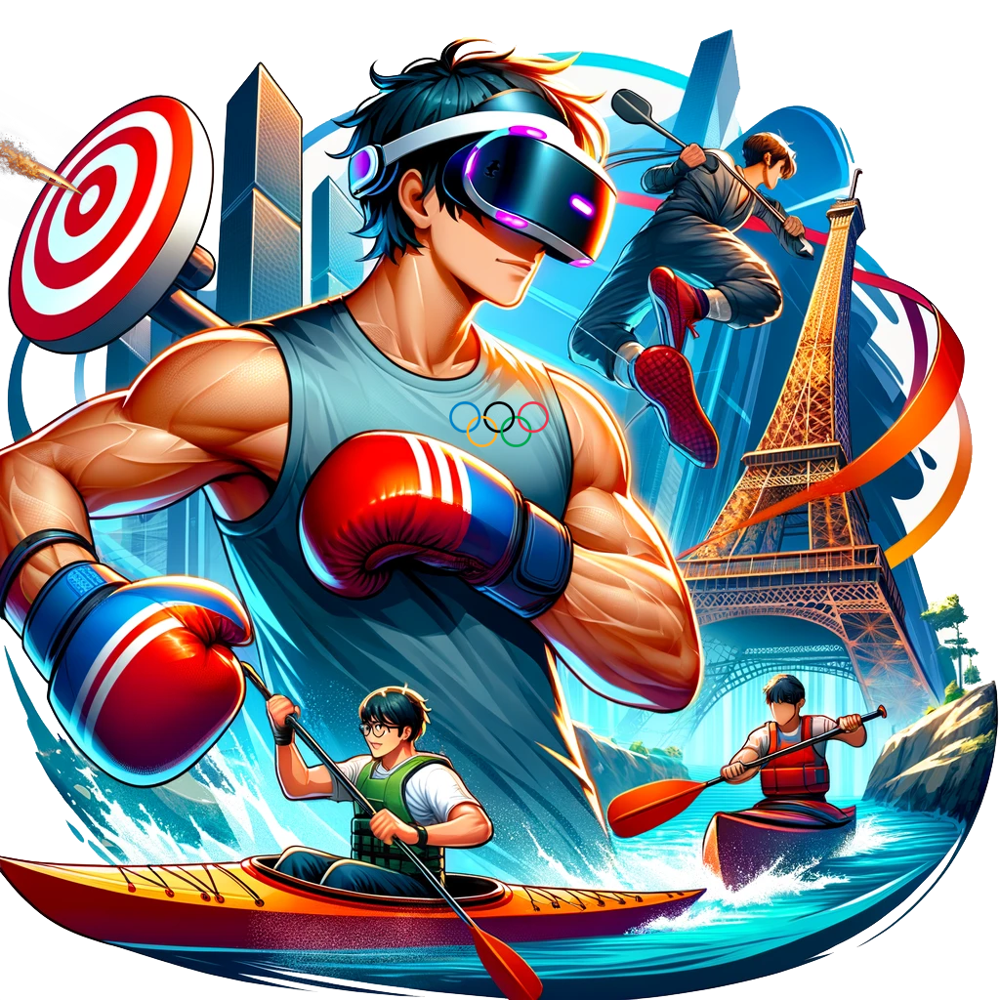
  </a>

  <h1 align="center">Athlete Simulator</h1>

  <p align="center">
    Games on web 2024 Olympic edition
    <br />
    <a href="https://youtu.be/k0ebpO5Bg98"><strong>Vidéo démo 🎬»</strong></a>
    <br />
    <br />
    <a href="https://athletesimulator-bf10928fd99f.herokuapp.com/">🎮Tester le jeu</a>
    ·
    <a href="https://github.com/Athlete-Simulator/GOW2024/issues">🐛Report Bug</a>
    ·
    <a href="https://github.com/Athlete-Simulator/GOW2024/issues">🌟Request Feature</a>
  </p>
</div>


<!-- TABLE OF CONTENTS -->
<details>
  <summary>Table des matières📚</summary>
  <ol>
    <li>
      <a href="#about-the-project">Athele simulator VR📖</a>
      <ul>
        <li><a href="#built-with">Développé à l'aide de 🛠️:</a></li>
      </ul>
    </li>
    <li>
      <a href="#getting-started">Pour Commencer🚀</a>
      <ul>
        <li><a href="#prerequisites">Prérequis</a></li>
        <li><a href="#installation">Installation💻</a></li>
      </ul>
    </li>
    <li><a href="#usage">Utilisation🎮</a></li>
    <li><a href="#roadmap">Contrôles🕹️</a></li>
    <li><a href="#license">Quelques Spoils📸</a></li>
    <li><a href="#contact">Contact📧</a></li>
  </ol>
</details>


## Athlete Simulator📖

### Bienvenue dans le Lab Zone

En 2024, alors que le monde entier attend avec impatience le grand spectacle des Jeux Olympiques de Paris, les athlètes du monde entier sont introduits à un environnement d'entraînement révolutionnaire connu sous le nom de Lab Zone. Cet espace ultramoderne n'est pas seulement un lieu d'entraînement; c'est un royaume où la technologie de pointe et l'aspiration humaine se fusionnent pour créer le terrain d'entraînement ultime pour les espoirs olympiques.

### Le Lab Zone : Votre Passerelle vers la Gloire Olympique

Imaginez entrer dans un espace où les frontières entre le virtuel et le réel s'estompent. Le Lab Zone est équipé des dernières avancées en technologie VR, propulsée par BabylonJS 7, et améliorée avec des effets visuels époustouflants. Cet environnement immersif offre aux athlètes la chance de vivre l'intensité des Jeux Olympiques avec un réalisme inégalé.

### Des Jeux Vidéo Olympiques dans le Lab Zone

#### 1. Jeu de Boxe

Dans le jeu de boxe du Lab Zone, vous entrez dans le ring virtuel, ressentant la tension palpable et le rugissement de la foule. Chaque coup, chaque esquive, et chaque mouvement sont reproduits avec une précision incroyable grâce à la technologie de suivi de mouvement avancée. Affrontez un adversaire redoutable et affinez vos compétences avec des entraînements spécifiques conçus pour améliorer votre vitesse, votre force et votre stratégie. Vous ne vous entraînez pas seulement pour la victoire; vous vous préparez à devenir un champion olympique.

#### 2. Jeu de Canoë-Kayak

Le jeu de canoë-kayak du Lab Zone vous transporte sur la Seine de Paris pour une course palpitante contre trois adversaires en barque. Profitez d'une vue imprenable sur la Tour Eiffel tandis que vous pagayez avec détermination. La précision de votre technique et votre endurance sont mises à l'épreuve. Travaillez votre synchronisation et votre vitesse pour traverser la ligne d'arrivée en premier et revendiquer votre victoire.

#### 3. Jeu de Tir Sportif

Dans le jeu de tir sportif du Lab Zone, la précision est essentielle. Entrez dans un stand de tir virtuel ultra-réaliste où chaque détail, du son de la détonation au recul de l'arme, est fidèlement reproduit. Commencez par un entraînement intensif où vous devez réussir 11 points pour reculer la cible à la distance officielle des épreuves olympiques. Ensuite, passez à la phase de compétition où chaque tir compte : cinq tirs sont comptabilisés, avec un point vert pour chaque réussite et un point rouge pour chaque échec. Affinez votre visée et votre concentration pour atteindre la perfection.

### L'Aventure Commence

Votre aventure dans le Lab Zone va au-delà de l'entraînement; c'est une odyssée de découverte de soi et de poursuite incessante de l'excellence. Ici, vous rejoignez une communauté d'athlètes partageant la même vision, chacun motivé par le rêve de la gloire olympique. 


<br>
<br>


### Développé à l'aide de 🛠️ :


* 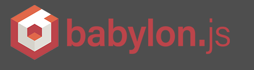
* ![Node.js][Node.js]
* ![TypeScript][TypeScript]
* 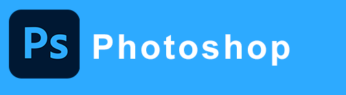
* 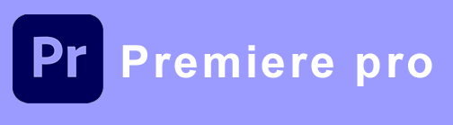
* 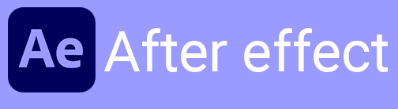
* 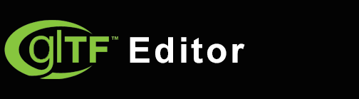
* 
* 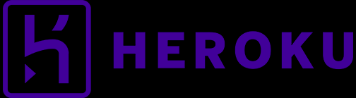


<br>
<br>


## Pour commencer 🚀

<br>

### Prérequis ✨

Pour commencer, assurez-vous d'avoir Node.js installé sur votre machine. Ensuite, téléchargez ou clonez le projet depuis le repository :

```sh
git clone https://github.com/Athlete-Simulator/GOW2024.git
```

### Installation 💻

1. Accédez au répertoire du projet :

```sh
cd GOW2024
```

2. Installez les dépendances du projet :

```sh
npm install
```

3. Générez les certificats SSL nécessaires :

```sh
openssl req -newkey rsa:2048 -new -nodes -x509 -days 3650 -keyout key.pem -out cert.pem
```

4. Assurez-vous que votre casque VR est connecté au même réseau Wi-Fi que l'ordinateur sur lequel le serveur est hébergé.

5. Lancez le serveur en mode VR :

```sh
npm run vr
```

6. Depuis le navigateur de votre casque VR, entrez l'adresse IP de l'ordinateur hébergeant le serveur, suivie du port 8080 (par exemple, http://192.168.1.333:8080).
Le jeu Athlete Simulator se chargera dans votre casque VR. Utilisez les contrôles de votre casque VR pour interagir avec le jeu.

### Remarques

- Assurez-vous que les ports nécessaires sont ouverts sur votre pare-feu.
- Si vous rencontrez des problèmes de connexion, vérifiez la configuration réseau de votre casque VR et de votre ordinateur.
- Pour des performances optimales, un réseau Wi-Fi à faible latence est recommandé.

<br>
<br>


## Contrôles 🕹️

<br>
<br>


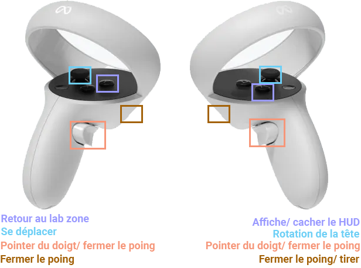


<br>
<br>
<br>


## Quelques Spoils 📸

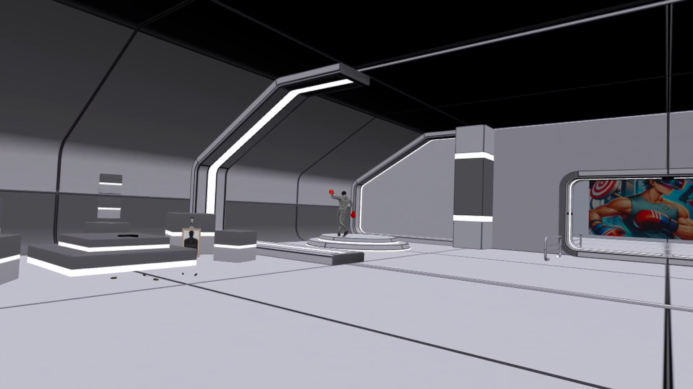

<br>


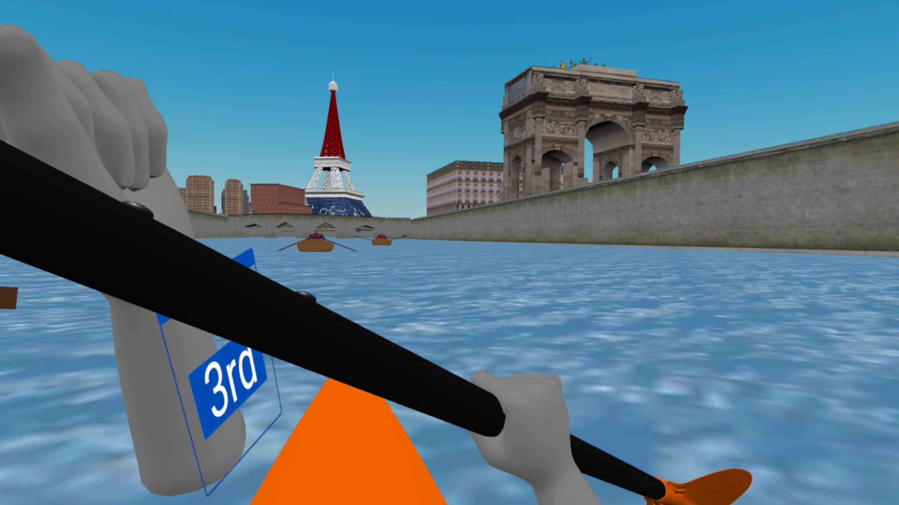

<br>

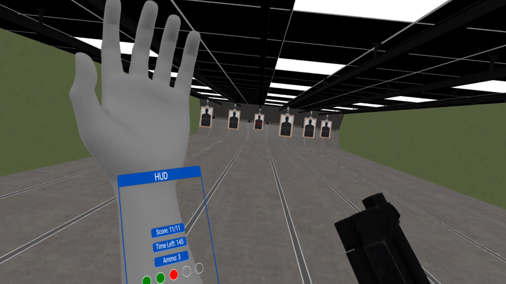

<br>

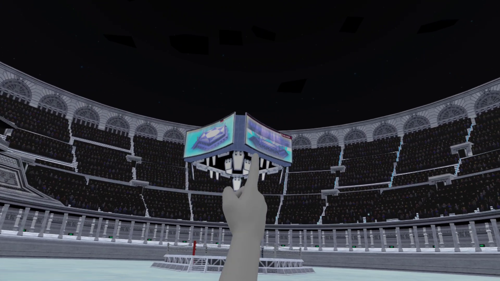

<br>

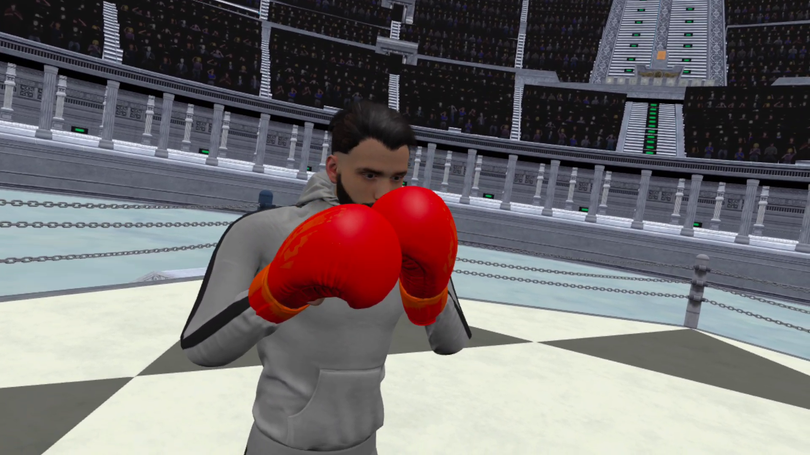

<br>

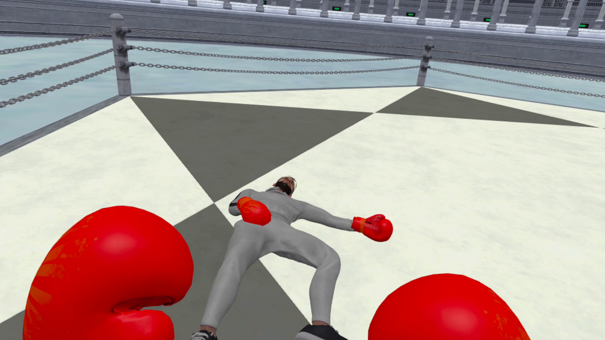


<!-- CONTACT -->
## Contact 📧

Adem BenJabria - Adem.bj@gmail.com - https://adem-benjabria.fr 
[![LinkedIn][linkedin-shield]][linkedin-url]

<br>

Merci d'avoir porté attention à mon projet ! 👍


<!-- MARKDOWN LINKS & IMAGES -->
<!-- https://www.markdownguide.org/basic-syntax/#reference-style-links -->

[contributors-shield]: https://img.shields.io/github/contributors/othneildrew/Best-README-Template.svg?style=for-the-badge
[contributors-url]: https://github.com/othneildrew/Best-README-Template/graphs/contributors
[forks-shield]: https://img.shields.io/github/forks/othneildrew/Best-README-Template.svg?style=for-the-badge
[forks-url]: https://github.com/othneildrew/Best-README-Template/network/members
[stars-shield]: https://img.shields.io/github/stars/othneildrew/Best-README-Template.svg?style=for-the-badge
[stars-url]: https://github.com/othneildrew/Best-README-Template/stargazers
[issues-shield]: https://img.shields.io/github/issues/othneildrew/Best-README-Template.svg?style=for-the-badge
[issues-url]: https://github.com/othneildrew/Best-README-Template/issues
[license-shield]: https://img.shields.io/github/license/othneildrew/Best-README-Template.svg?style=for-the-badge
[license-url]: https://github.com/othneildrew/Best-README-Template/blob/master/LICENSE.txt
[linkedin-shield]: https://img.shields.io/badge/-LinkedIn-black.svg?style=for-the-badge&logo=linkedin&colorB=555
[linkedin-url]: https://www.linkedin.com/in/adem-ben-jabria-532395221/
[product-screenshot]: images/screenshot.png
[Node.js]: https://img.shields.io/badge/Node.js-43853D?style=for-the-badge&logo=node.js&logoColor=white
[Node-url]: https://nodejs.org/
[TypeScript]: https://img.shields.io/badge/TypeScript-3178C6?style=for-the-badge&logo=typescript&logoColor=white
[TypeScript-url]: https://www.typescriptlang.org/
[AdobePremierePro-url]: https://www.adobe.com/fr/products/premiere/landpb.html?gclid=CjwKCAjwpuajBhBpEiwA_ZtfheMObLBs9Q4Vnxg6geNdVowGD85T5CcSFGh4cMJ_Bbj0lxPBGRWlURoCEUIQAvD_BwE&mv=search&mv=search&sdid=LQLZT7BT&ef_id=CjwKCAjwpuajBhBpEiwA_ZtfheMObLBs9Q4Vnxg6geNdVowGD85T5CcSFGh4cMJ_Bbj0lxPBGRWlURoCEUIQAvD_BwE:G:s&s_kwcid=AL!3085!3!341240727116!e!!g!!premier%20pro!1435912308!56537471939&gad=1